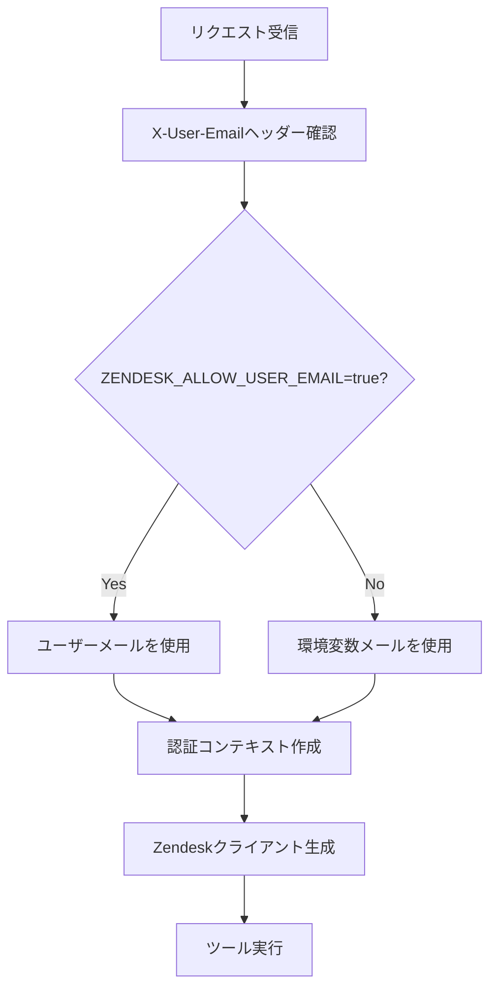

# 03 HTTP Transport 対応 - 実装ドキュメント

## 概要

本実装では、既存のstdio TransportからStreamable HTTP Transportへの完全移行を行い、LibreChatクライアントとの統合を実現しました。X-User-Emailヘッダーからのユーザーメール動的取得機能も実装しています。

## アーキテクチャの変更

### 1. Transport層の変更

**変更前 (stdio Transport)**
```typescript
const transport = new StdioServerTransport();
await server.connect(transport);
```

**変更後 (HTTP Transport)**
```typescript
const httpServer = new HttpServer({ port, logger });
await httpServer.start();
```

### 2. 新しいコンポーネント

#### HttpServer (`src/server/http.ts`)
- Express.js ベースのHTTPサーバー
- StreamableHTTPServerTransportの管理
- セッション管理（セッションIDベース）
- POST/GET/DELETEエンドポイントの提供

#### AuthContextManager (`src/utils/auth-context.ts`)
- リクエスト毎の認証コンテキスト管理
- X-User-Emailヘッダーの処理
- Zendesk認証の動的切り替え

#### RequestContextManager (`src/utils/request-context.ts`)
- AsyncLocalStorageを使用したリクエストスコープのコンテキスト管理
- ツール実行時の認証情報の提供

## 実装の詳細

### 1. HTTPエンドポイント

| エンドポイント | メソッド | 用途 |
|---------------|---------|------|
| `/mcp` | POST | MCP リクエストの処理 |
| `/mcp` | GET | SSE ストリームの確立 |
| `/mcp` | DELETE | セッション終了 |
| `/health` | GET | ヘルスチェック |

### 2. セッション管理

```typescript
interface TransportMap {
    [sessionId: string]: StreamableHTTPServerTransport;
}
```

- セッションIDをキーとした транспорт管理
- セッション初期化時の自動登録
- セッション終了時の自動クリーンアップ

### 3. 認証コンテキスト

```typescript
interface AuthContext {
    userEmail?: string;
    isUserEmailAllowed: boolean;
    effectiveUsername: string;
}
```

- X-User-Emailヘッダーからのメール取得
- 環境変数設定による動的認証切り替え
- リクエスト毎のコンテキスト分離

### 4. 動的メール認証フロー



## 環境変数の設定

### 必須環境変数

```env
# Zendesk 基本設定
ZENDESK_SUBDOMAIN=your-subdomain
ZENDESK_USERNAME=your-email@example.com
ZENDESK_API_TOKEN=your-api-token

# HTTP Transport設定
MCP_PORT=3000

# ユーザーメール認証許可（オプション）
ZENDESK_ALLOW_USER_EMAIL=true
```

### 設定の説明

- `ZENDESK_ALLOW_USER_EMAIL=true`: X-User-Emailヘッダーの値をZendesk認証に使用
- `ZENDESK_ALLOW_USER_EMAIL=false` または未設定: 環境変数の固定メールを使用
- `MCP_PORT`: HTTPサーバーのポート番号（デフォルト: 3000）

## LibreChat設定例

### librechat.yaml設定

```yaml
mcpServers:
  zendesk:
    transport: streamable-http
    url: http://localhost:3000/mcp
    headers:
      X-User-Email: "{{LIBRECHAT_USER_EMAIL}}"
    env:
      ZENDESK_SUBDOMAIN: "your-subdomain"
      ZENDESK_USERNAME: "fallback-email@example.com"
      ZENDESK_API_TOKEN: "${ZENDESK_API_TOKEN}"
      ZENDESK_ALLOW_USER_EMAIL: "true"
      MCP_PORT: "3000"
```

### ヘッダーの動作

- `{{LIBRECHAT_USER_EMAIL}}`: LibreChatがログインユーザーのメールアドレスに置換
- X-User-Emailヘッダーが設定されていない場合は環境変数の`ZENDESK_USERNAME`を使用

## ツールの動作変更

### create_ticket ツール

**機能追加**
- リクエスタメールの自動設定
- X-User-Emailヘッダーからの動的メール取得

**動作ロジック**
1. 明示的にrequester.emailが指定されている場合はそれを使用
2. X-User-Emailがあり、`ZENDESK_ALLOW_USER_EMAIL=true`の場合はそれを使用
3. それ以外の場合はZendeskのデフォルト動作に依存

### search_articles & get_article_content ツール

**変更点**
- リクエストコンテキストからの認証情報取得
- 動的なZendeskクライアント生成
- 詳細なログ出力

## パフォーマンス最適化

### 1. クライアントキャッシュ

```typescript
const clientCache = new Map<string, any>();
```

- effectiveUsernameをキーとしたZendeskクライアントのキャッシュ
- 同一ユーザーによる連続リクエストの高速化

### 2. セッション管理

- StreamableHTTPServerTransportのセッション再利用
- 不要なセッションの自動クリーンアップ

## セキュリティ考慮事項

### 1. ユーザーメール検証

- LibreChatから受信するX-User-Emailヘッダーの検証は行っていない
- 信頼できるリバースプロキシ環境での運用を想定

### 2. API Token管理

- Zendesk API Tokenは環境変数で管理
- ユーザーメールによる認証でも同一のAPI Tokenを使用

### 3. エラーハンドリング

- 認証エラー時の適切なエラーレスポンス
- センシティブ情報のログ出力回避

## トラブルシューティング

### 1. よくあるエラー

**No request context found**
- 原因: AsyncLocalStorage のコンテキスト外での実行
- 解決: HTTP Transport経由でのリクエストを確認

**Missing required Zendesk configuration**
- 原因: 環境変数の未設定
- 解決: 必須環境変数の設定確認

### 2. デバッグ方法

**ログレベルの調整**
```typescript
// より詳細なログ出力
const logger = setupLogger();
logger.level = 'debug';
```

**認証コンテキストの確認**
```typescript
const authContext = requestContext.getCurrentAuthContext();
console.log('Auth context:', authContext);
```

## テスト戦略

### 1. 単体テスト

- **現在の状態**: リクエストコンテキスト導入により既存テストが失敗
- **必要な対応**: テストケースでのリクエストコンテキストのモック化

### 2. 統合テスト

- HTTP Transport全体の動作確認
- LibreChatとの連携テスト
- 異なる認証シナリオのテスト

### 3. 性能テスト

- 複数セッションでの同時接続テスト
- メモリリーク検証
- レスポンス時間の測定

## 今後の拡張ポイント

### 1. 認証機能の強化

- OAuth 2.0対応の検討
- ユーザー権限の細分化

### 2. 監視・メトリクス

- Prometheus メトリクス出力
- ヘルスチェック機能の拡張

### 3. スケーラビリティ

- Redis を使用したセッション管理
- 複数インスタンス対応

## 互換性情報

### Node.js バージョン

- **必須**: Node.js v24.3.0 以上
- **推奨**: 最新のLTSバージョン

### MCP SDK バージョン

- **使用バージョン**: @modelcontextprotocol/sdk 1.16.0
- **対応機能**: Streamable HTTP Transport

### LibreChat バージョン

- **対応バージョン**: streamable-http transport をサポートするバージョン
- **ヘッダー機能**: `{{LIBRECHAT_USER_EMAIL}}`置換をサポートするバージョン